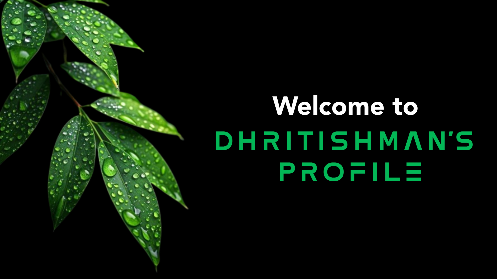

■█■█■█■█■█■█■█■

  

---

<!-- Banner GIF -->
<h1 align="center" style="font-family: monospace; color:#39ff14;">
Meow 😼
</h1>

  

---

## 🙋‍♂️ About Me 

- 🔥 Love writing bullshit in Python and HTML
- ⚔️ Chaotic coder from 🇮🇳  
- 🧪 Loves breaking things (accidentally or not)  
- ☕ Runs on caffeine, bugs, and hope
- 🎮 Life is itself a game
- ☁️⚡

---

## 💻 Terminal Setup

$ whoami  
> Dhritishman — Thara Bhai | Forever 

$ tools  
> Python (mothertongue)  
> HTML (for shiny stuff)  
> Editors: Sublime Text, Spyder, VS Code

$ motto  
> "Write. Crash. Sleep. Repeat."

---

## 📈 Stats for Nerds

 
 

---

## 🏆 GitHub Trophies

---

## ⚔️ Note:

> **"I don't always write code...  
> but when I do, it crashes successfully."**

  

---

  

---

# 💻 Tech Stack:
 
 
 
 
 
 
 
 
 
 
 
 
 
 
 
 
 
 
 
 
 
 
 
 
 
 
 
 
 

___

## 💬 Final Words

> `"If it works... don't touch it.  
> If it doesn't... still don't touch it."`

  

<b>ಠ_ಠ Still here?</b> Go check a repo or something.

---
